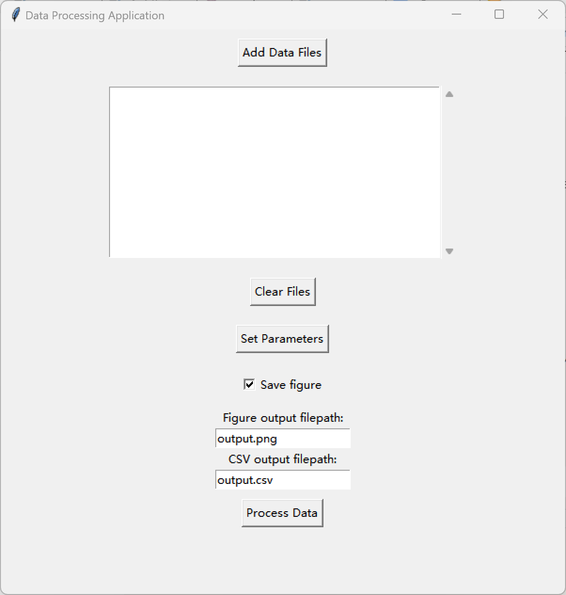

# OECT-Data-Processing

> Author: Yi Li (AsanoLydia)
> 
> Supervisor: Onur Parlak
> 
> Period: June - August 2024
> 
> Department of Medicine, Solna, Karolinska Institute

A graphical user interface tool for processing Organic Electrochemical Transistor (OECT) measurement data obtained from sourcemeter. This tool normalizes drain current data and exports results in both visual and tabular formats.


## Features

 -  **Multi-file Processing**: Load and process multiple data files simultaneously
-   **Intuitive GUI**: User-friendly interface built with Tkinter
    
-   **Customizable Normalization**: Set normalization parameters based on time points
    
-   **Flexible Output**: Generate both CSV data files and PNG charts
    
-   **Error Handling**: Robust error detection with user-friendly messages

## Quick Start
### Requirements
| Package    |Version        |
|------------|---------------|
| Python     | 3.12.10 or higher |
| pandas     | 2.2.2         |
| matplotlib | 3.8.2         |
| numpy      | 1.26.3        |

### Installation
1. Clone the repository:

```
    git clone https://github.com/yourusername/oect-data-processor.git
    cd oect-data-processor
```
2. Install dependencies:
```
pip install -r requirements.txt
```
### Run the application
```
python handle_OECT_data_gui_4.py
```

## User Interface
The application provides a clean and intuitive interface:


### Main components
- **Add Data Files**: Add multiple data files for batch processing
- **Clear Files**: Delete all loaded data files
- **Set Parameters**: Set normalization reference point, normalized value and data reading start line. 
- **Save figure**: Determine whether to save the output figure or not.
- **Figure/CSV output filepath**: Set output filepath for the figure or CSV files.

## Parameters
|Parameter  | Unit |Interpretation|
|--|--|--|
| Normalization Reference Point |Seconds  |Specifies the time point used as reference for normalization   |
|Normalized Value| Microamperes (μA)|Target value for the reference point after normalization|
|Read Lines From|N/A|Line number to start reading data from (skips file headers)|
## Data format
### Input format
The tool expects text files with the following structure:

-   Time (ms, automatically converted to seconds)
-   Gate voltage (unused in current version)
-   Drain current (mA, automatically converted to μA)  
-   Gate current (unused in current version)

### Output 
#### CSV File:
Contains normalized drain current for all processed files:

-   First column: Time (seconds)    
-   Subsequent columns: Normalized drain current for each file (μA)
-   Column names: Cleaned filenames
#### PNG Figure (Optional):
-   X-axis: Time (seconds) 
-   Y-axis: Normalized drain current (μA)
-   Automatically saved to specified location


